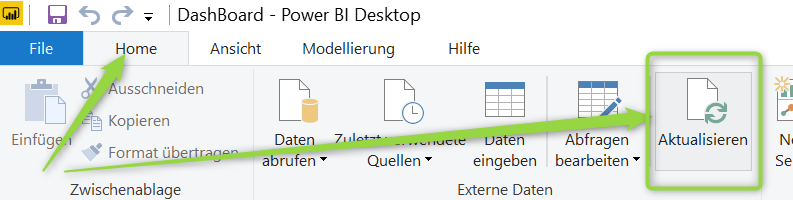

# Manuelles Update empfohlen für LDAP Channel Binding und LDAP Signing
[infoWAN Artikel vom 25. September 2019](https://infowan.de/windows-update-fuer-ldap/ "infoWAN Artikel vom 25. September 2019")

In dem oben genannten Artikel wird beschrieben, dass Microsoft ein Update herausbringt, welches nach der Installation auf Domain Controllern nur noch sichere LDAP Verbindungen zulässt.

Dieser Artikel beschreibt meine Scripts, die es einem Administrator einer Active Directory Domain erleichtern herauszufinden, ob die eigene Domain hiervon betroffen ist.

Hierfür stelle ich folgendes bereit:

1. **PowerShell Script**: Check-DomainControllerLDAPEvents.ps1
2. **GPO**: Gruppenrichtlinie für die Konfiguration vom Remote Management der Systeme (Domain Controllern)
3. **PowerShell Script**: Start-LDAPInterfaceEventLogging.ps1

## Voraussetzungen
Die besten Ergebnisse erhalten Sie, wenn Sie die Scripts auf einem System ausführen, dass diese Voraussetzungen erfüllt.
- Windows Server 2012 R2 oder neuer
- PowerShell Modul: Active Directory
- PowerShell Remoting muss für alle Domain Controller konfiguriert sein! (GPO hierfür liegt im Ordner RemoteManagementGPO)
- FireWall Konfiguration für den Remote Zugriff muss konfiguriert sein! Dies wird durch die oben genannte GPO ebenfalls konfiguriert.
- Mitgliedschaft in der Gruppe Domänen Admins

# Check-DomainControllerLDAPEvents.ps1
Dieses Script prüft per Get-WinEvent alle Domain Controller der Domain und sucht nach dem Event mit der ID 2887 im Directory Service Event Log. Findet dieses Script Domain Controller, bei dem das Event auftritt, dann wird im Verzeichnis ~\Documents eine CSV Datei erstellt und nach Prüfung aller Domain Controller wird in der Shell eine Tabelle ausgegeben.

Header der CSV Datei:
"DomainController","Count"

# Kein Domain Controller oder einige sind nicht für Remote Management konfiguriert
Sollten Sie feststellen, dass einige Domain Controller nicht für Remote Management konfiguriert sind, dann können Sie die mitgelieferte Gruppenrichtlinie bereitstellen um Remote Management für alle Domain Controller zu konfigurieren.

## Welche Einstellungen werden verteilt
Die Gruppenrichtline konfiguriert folgende Bereiche:
- Aktivieren folgender Dienste:
    - Windows Management Instrumentation
    - Windows Remote Management
- Windows Firewall: Die Firewall wird nicht aktiviert, es werden lediglich Regeln verteilt, die remote Management erlauben.
- WinRM Client und Service

Diese vordefinierten Einstellungen werden in der Richtlinie konfiguriert. 

Einstellungen der Gruppenrichtlinie effektiv. 

### Einrichtung Gruppenrichtlinie
Zu Konfiguration der Gruppenrichtlinie legen Sie eine neue leere Richtlinie auf dem Domain Controller Container an und importieren die Richtlinien-Einstellungen aus dem Verzeichnis, welches sich im Verzeichnis RemoteManagementGPO befindet. Wenn Sie den Import erfolgreich abgeschlossen und die Richtlinie aktiviert haben, warten Sie zwei Stunden, bis die Richtlinien auf allen Domain Controller aktiviert wurden. Wenn Sie mehrere Standorte besitzen, kann die Aktivierung der Richtlinien länger dauern.

# Start-LDAPInterfaceEventLogging.ps1
## Anwendung
Zu Ausführung des Scriptes startet Sie eine **Administrative** PowerShell und wechseln in das Verzeichnis, in dem Sie das Script gespeichert haben.
Das Script kann ohne Parameter gestartet werden!

Ausführung des Scripts im Standard Modus
Hier wird das Logging für jeden Domain Controller für 30 Minuten aktiviert!
<code> .\Start-LDAPInterfaceEventLogging.ps1</code>

Ausführung mit Angabe der Laufzeit in Minuten
<code> .\Start-LDAPInterfaceEventLogging.ps1 -Runtime "Minuten"</code>

## Auswertung von simple und unsignierten LDAP Bindungen der Domain Controller
Dieses Script liest die zuvor erstellte CSV Datei ein, wenn diese nicht älter als 15 Minuten ist. Wenn die Datei älter ist, wird die Prüfung automatisch erneut durchgeführt und die CSV Datei neu geschrieben. Die CSV Datei wird eingelesen und jeder Domain Controller, der mindestens ein Event (ID 2887) besitzt, wird für das LDAP Logging aktiviert.

### Welche Aufgaben führt das Script aus?
- Per Get-ADDomain wird der Container der Domain Controller abgefragt und darin nach Computerobjekten gesucht
- Jeder Domain Controller wird auf Erreichbarkeit und auf das Event 2887 im Directory Service Event Log geprüft
- Ist der Domain Controller erreichbar und wurde das Event gefunden, wird geprüft, ob diese per Remote Management erreichbar ist
- Wenn der Domain Controller erreichbar ist:
  - Wird die Größe der **Directory Service** Event Log ausgelesen und in eine Variable geschrieben
  - Die Größe des Event logs wird auf 3GB Größe eingestellt und das Logging aktiviert
  - Anschließend wird das Logging für die angegebene Zeit durchgeführt
  - Ist die Zeit verstrichen, werden die Events aus dem Event Log eingelesen und in eine CSV Datei geschrieben
  - Die Ursprungsgröße des Event Logs wird zurückgestellt
  - Die lokale CSV Datei wird anschließend auf den ausführenden Server kopiert und unbenannt
- Diese Prozedur wiederholt sich für jeden Domain Controller in der CSV Datei!

Folgende Registry-Einstellungen werden geändert: 
<code>HKLM:"SYSTEM\CurrentControlSet\Services\EventLog\Directory Service" -Name 'MaxSize' -Type DWord -Value '3221225472' 
HKLM:"SYSTEM\CurrentControlSet\Services\NTDS\Diagnostics" -Name '16 LDAP Interface Events'</code>

Die CSV Dateien werden im Dokumente Ordner des angemeldeten Benutzers gespeichert, wobei die Kopfzeile wie folgt erstellt wird: "DomainController","IPAddress","Port","User","BindType"

<code>%UserProfile%\Documents</code>

Nachdem alle Domain Controller abgefragt wurden, werden alle lokalen CSV Dateien eingelesen und die Summe aller Dateien in die Datei %UserProfile%\Documents\InsecureLDAPBinds.csv geschrieben. Die Ausgabe in der PowerShell wird gruppiert nach Domain Controller und Quell IP ausgegeben.

## GenerateSampleData.ps1
Dieses Script dient lediglich dazu Beispiel Daten für den PowerBi Report zu generieren. Das Script muss auf dem System gestartet werden, welches PowerBi installiert hat.

## PowerBI Report
In diesem Repository habe ich für Sie einen PowerBI Report zur Verfügung gestellt. Dieser kann zur grafischen Darstellung und zum Filtern oder Sortieren der Events genutzt werden. Sie benötigen hierfür lediglich die PowerBi App aus dem Microsoft Store.

Damit Sie in PowerBi keine Änderungen vornehmen müssen, kopieren Sie folgenden CSV Dateien von dem Server in folgenden Pfad lokal. 
<code>%Public%\Documents</code>

Quelldateien vom Server auf dem das Script ausgeführt wurde:
- %UserProfile%\Documents\InsecureLDAPBinds.csv
- %UserProfile%\Documents\InsecureLDAPCount.csv

Sie können jetzt PowerBi starten, wählen in der Ribbon Bar Home und Daten aktualisieren aus. Es dann werden ihre Daten eingelesen und angezeigt. Sollte es bei der Aktualisierung Fehler geben, stellen Sie sicher, dass die oben genannten CSV Dateien am richtigen Ort gespeichert wurden.

**Hinweis:** *Da PowerBi die Daten zwischenspeichert, müssen Sie auf jeden Fall die Ansicht aktualisieren, Sie Daten aktualisieren.*

## Daten aktualisieren

## Übersicht PowerBi Report

